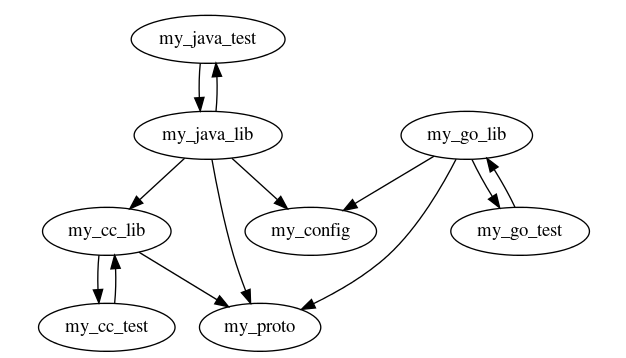

# Splitbrain: Automatic CL Splitting

Splitbrain is a research system aiming to compute disjoint changelists
from a single code diff, and apply them to a user's workspace.

The motivation of this work follows from the intuition that smaller CLs have a
few benefits:

* Faster turnaround time in code reviews
* Smaller, atomic units of code committed in each CL
* Easier rollback

This repository contains a series of tools and experiments designed to further
understand this relationship, however it is _not a usable tool_ and is
exclusively an algorithmic research system.

## Overview

At a high level, Splitbrain interprets a subset of the
[Bazel](http://bazel.build) and [Kythe](http://kythe.io) graphs relevant to a
single CL, and builds a linear chain of CLs based on the original CL.

<p align="center">
    
</p>

For example, a medium sized code change with 250 LoC could split into 5 changes
of 50 LoC each.

These changes can be reviewed and potentially submitted in parallel.

## Documentation

The original design doc is bundled with the source code. See [`docs/DESIGN.md`](docs/DESIGN.md) for details.

## Building

Splitbrain uses [bazel](http://bazel.build) as it's build system.

Quick start:

```
bazel build //... && bazel test //...
```

## Contributing

See [`CONTRIBUTING.md`](CONTRIBUTING.md) for details.

## License

Apache 2.0; see [`LICENSE`](LICENSE) for details.

## Disclaimer

This project is not an official Google project. It is not supported by
Google and Google specifically disclaims all warranties as to its quality,
merchantability, or fitness for a particular purpose.
