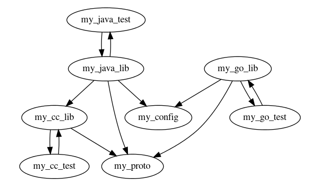
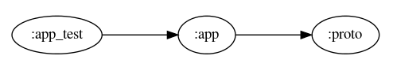
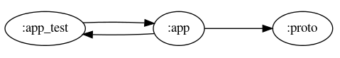
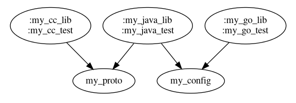
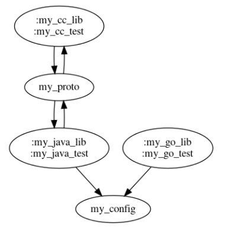
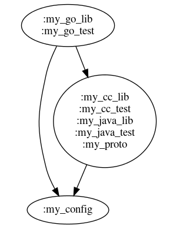
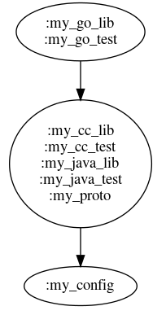
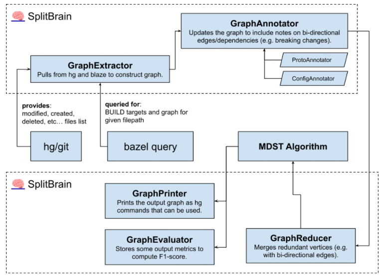
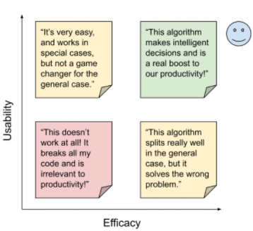

# SplitBrain Design Doc

<strong>Created</strong>: 2021-07-29

<strong>Author</strong>: Cameron Brown (<a href="mailto:cambr@google.com">cambr@google.com</a>)

<strong>Visibility</strong>: Deprecated (V1, Internal)

## Objective & Vision
Research and develop a workable productivity tool for splitting up changelists into atomic units.

There are really two parts to this project:
1. Develop viable algorithmic solvers to search over the solution space in a reasonable time
2. General engineering productivity research on the efficacy of such a tool

## Overview
In short, this is a CLI tool that can be added to a personal git presubmit, with recommendations on how to split up (or fold) your changelist. This model also provides optional suggestions. Upon launching the `splitbrain` binary the program validates that the current working directory is within a dirty (unsubmitted changes) git workspace.

A few examples of the findings that the program could look for:

<table>
  <tr>
   <td>Pattern
   </td>
   <td>Message
   </td>
  </tr>
  <tr>
   <td>ProtoApiChange
   </td>
   <td>“Protobuf messages and service definition changes should be checked in separately.”
   </td>
  </tr>
  <tr>
   <td>ConfigChange
   </td>
   <td>“Code configs should be checked in separately to main changes.”
   </td>
  </tr>
  <tr>
   <td>RefactoringChange
   </td>
   <td>“Unrelated refactorings should be checked in separately to main changes”
   </td>
  </tr>
  <tr>
   <td>InterfaceChange
   </td>
   <td>“Interfaces should be checked with at least one working example.”
   </td>
  </tr>
  <tr>
   <td>MultipleProjects
   </td>
   <td>“Shard this large change per OWNERS</a>.”
   </td>
  </tr>
  <tr>
   <td>MultipleTimezones
   </td>
   <td>“Shard this change per reviewer timezone (US, DE) to reduce round trips.”
   </td>
  </tr>
  <tr>
   <td>...
   </td>
   <td>...
   </td>
  </tr>
</table>

This is not a comprehensive list, but it should be updated with time. There are a bunch of motivating factors for building such a tool:

* Sending large changelists is generally easier, as splitting them up isn’t easy
* Encourage and enforce best practices 
* Reduce code review burden by significantly decreasing the average size of a changelist 
* Build a concrete set of tribal knowledge across the engineering organization
* Aggregate increase productivity due to encouraging small incremental changes

The first version of this project will focus on file-based analysis only (no static analysis), and implement a few of the basic patterns mentioned above: ProtoApiChange, ConfigChange and DataChange.

## Detailed design (note: V1, deprecated)

The CLI binary will be distributed with the intention of being run directly. Ideally providing:

* user-friendly String suggestion for stdout.
* git commands needed to form the suggested graph.
* link to documentation with rationale (or possibly, rationale itself).

### “Diff graph” data structure

The first component is a new data structure called the “diff graph”. This is the subset of the BUILD graph wholly present in a given CL, so the sum of every BUILD target with a modified file.

Fig 1: Diff graph example.

This is computed by running a series of bazel query commands over each modified file to find the associated BUILD target and the graph of dependencies. From there, the diff graph will be constructed to operate over. An important note is that the bazel server can either be local bazel or use remote execution, so the choice will be left up to configuration.

If the diff graph is stored on disk, it will use a protocol buffer format.

### I/O (bazel, git, etc…)

The first problem to be addressed is interfacing with the existing toolchain, namely bazel and git. For bazel, the standard query interface will be used to construct the “diff graph”.

### Proposed core algorithm

#### Step #1: Constructing the graph from the initial changelist

So first, the graph is based on the initial changeset’s modified files, from which the associated BUILD target is referenced to construct the graph. The raw input could look like this, a list of modified files:

* `java/com/example/my_app/MyActivity.java`
* `javatests/com/example/my_app/MyActivityTest.java`
* `example/my_app/my_service.proto`

The next step is to convert them into modified BUILD targets:

* `//java/com/example/my_app:app`
* `//javatests/com/example/my_app:app_test`
* `//example/my_app/proto:proto`

From which, the graph can be clearly extracted via bazel queries:

Because tests are directly dependent on the targets they are testing, and vice versa (we don’t want new changes to break the old tests), a modified test is automatically considered an implicit dependency. Thus, the graph is slightly modified:

Changes are assumed to be forwards-and-backwards compatible by default, so the implicit dependency is ignored unless an explicit Analyzer is implemented.

This is a limitation of the proposed algorithm, though it would be possible to fix it in future with plugins.

### Step #2: Merging changes in a dependency aware (directed) graph

Next, the algorithm merges the nodes that have a bi-directional edge (“bi-dependent”) changesets together into a single node. This simplifies the example graph to look something like this:

#### Example: Breaking change

If the changes to :my_proto were detected to be a breaking change (e.g. a bi-directional edge), the resulting transformation to the graph would look something like this:

<table>
  <tr>
   <td>
    
   </td>
   <td>
    
   </td>
  </tr>
  <tr>
   <td><strong>Pre-Merge</strong>
   </td>
   <td><strong>Post-Merge</strong>
   </td>
  </tr>
</table>

#### Step #3: Removing redundant edges in the graph

The goal is to produce an acyclic, minimally connected graph with no redundant edges. In this case, a spanning tree will be created. This structure is also known as a minimum directed spanning tree (MDST). 

Continuing with the post-merge example in the breaking change example:

Once the spanning tree is constructed, this represents the minimum set of changelists that are able to be split off and submitted independently! Caveats are mainly BUILD file changes, so this would need to be handled as a special case. Tools such as `buildifier` and hg fix could automagically help fix those files.

#### Step #4: Fixing BUILD files among other things

The script will then invoke `buildifier` and apply a few other tricks to maintain the BUILD files. The full BUILD file will be appended to each change, and `buildifier` will then remove redundant edges.

### Program architecture

The input to the program is your diff including the file tree of everything it touches and BUILD graph, which is collected via integrations with tools such as bazel. The file diff and BUILD graph are joined to produce a directed dependency graph between the various diffed targets. This means that a later algorithm can cluster the changes with an understanding of which change must be checked in first.

There are a few different “Analyzers” that run synchronously, each providing a suggestion on how their rule is applied to the workspace. The program takes the different suggestions and applies them to produce an ideal state fig tree. This tree is then constructed via the suggested output command provided to the programmer.

### Batch job for analysis

V1 will not have practical output such as git commands, but should be an exploration of how the algorithm performs in limited cases.

The first step is to construct a list of relevant metrics, such as CL size or estimated review time.

Next, running the algorithm over a large set of changes (such as every change in the Linux Kernel) should yield interesting results. From that, we can determine a “lite” version of the program that simply outputs a set of suggestions.

Finally, taking those basic measurements and slicing them in useful ways, such as:

* Language (Java, C++, proto)
* Changelist size
* Code graph complexity

## Alternatives considered

### A quick overview of different approaches

* Machine learning on diffs
* Rules-based approach
* (Current) Graph mining and manipulation
* Graph clustering

### Notes on Kythe

A future version of the program could use [Kythe](http://kythe.io) data to find disjoint changes within a diff.

Note that this isn’t feasible to get perfectly right, but we can apply heuristics to give suggestions on more advanced line-by-line or AST-aware splits.

Using the Kythe graph allows the program to compute the maximal independent set before re-clustering the diffset together.

## Measuring improvements

<table>
  <tr>
   <td style="width: 40%">
    
    

        <strong>Solution space, visualized as a matrix.</strong>
    

   </td>
   <td>
<h3>Usability</h3>

Primary qualitative, but can be practically measured with some data.

A survey via Google Forms will be used to measure NPS plus a free-form box and prompting of questions.

Additionally, a hashtag will be added to the git commit description to allow the collection of another key metric: how often the suggestions from the tool are accepted.
   </td>
   <td>
<h3>Efficacy</h3>

Primarily quantitative, can be measured with data. To get a score on this, the Linux Kernel repo contains a lot of example changelists we can use as a ground truth.

A few base metrics:
<ul>

<li>Average split count

<li>Average split delta (e.g. see if it’s pareto distribution?)

Further metrics discovered via slicing by:
<ul>

<li>Language

<li>Diff size

<li>Number of reviewers

<li>Directories touched
</li>
</ul>
</li>
</ul>
   </td>
  </tr>
</table>